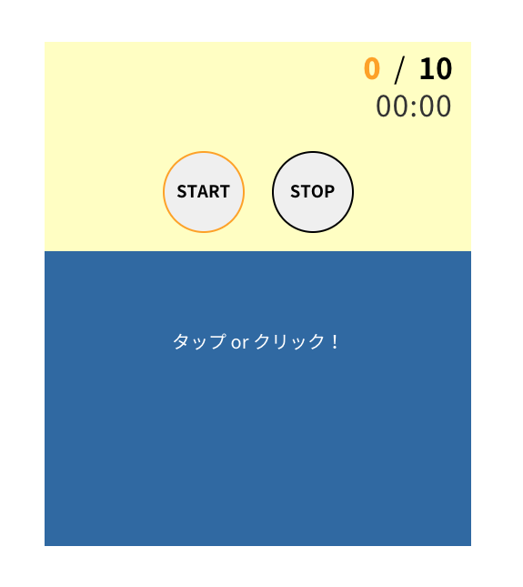

# ポンポンタイマー!

交互に問題を出し合う時に使える、制限時間付きタイマー。 
ポンポン答えることでアウトプットを鍛えるためのタイマーアプリ。 
問題数は変更できます。 

 

  

 
 

## 制作背景

 
アウトプットを鍛えるために、日々家族と「交互に山手線の駅名を25個答える」のようなゲームをしているのですが、
どうにも数えるのが億劫になってしまい、そのためのタイマーを作ることを考えはじめる。 

決定打となったのは、「東京23区全部答える」という問題で、数え間違いによりしばらく無駄に考えていたこと。 

 
 

## 使用技術

 

Pug, Sass, JavaScript 

webpack4 => gradle,babel

 
 
## 制作時間
 
細かい部分含めて(実働８時間として)1日弱程度。

 